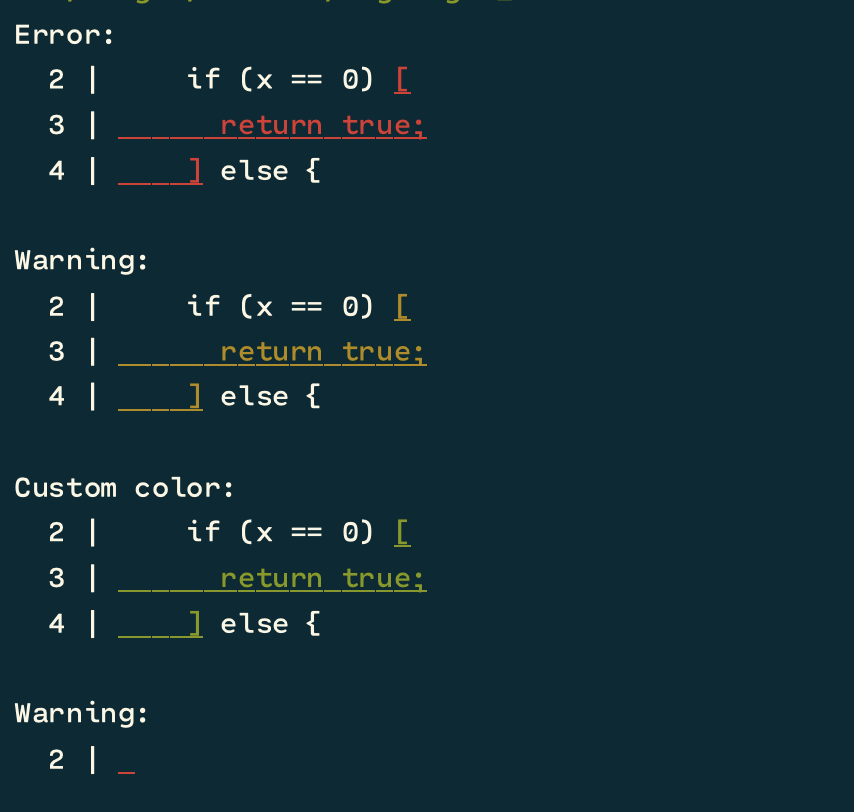

<samp>

Rust util that highlights an error.

- `code_highlighter` lets you highlight errors in your code and show extra lines around the error for better context.


Example

The code below:

```rust
let code = "functon is_zero (x) {
  if (x == 0) [
    return true;
  ] else {
    return false;
  }
}";
println!("Error:");
println!("{}", code_highlighter::highlight_error(38, 64, &code));
println!("");

println!("Warning:");
println!("{}", code_highlighter::highlight_warning(38, 64, &code));
println!("");

println!("Custom color:");
println!("{}", code_highlighter::highlight(38, 64, &code, "\x1b[4m\x1b[32m"));
println!("");

let code = "(Foo x) = 7[0 ]\n";
println!("Error:");
println!("{}", code_highlighter::highlight_error(16, 17, &code));
println!("");
```

Will output:




## Usage

1. Install using cargo

```shell
cargo add code_highlighter

```

2. `main.rs`

```rust
fn main() {
  use code_highlighter::highlight_error_with_context;

  // set the number of lines of context you want to show
  let context = 2; // Adds two lines above and below the error

  // assuming `range` has the error position and `source.raw` is your code
  let code = highlight_error_with_context(range.start, range.end, &source.raw, context);

  // print the highlighted code
  println!("{}", code);
}
```
